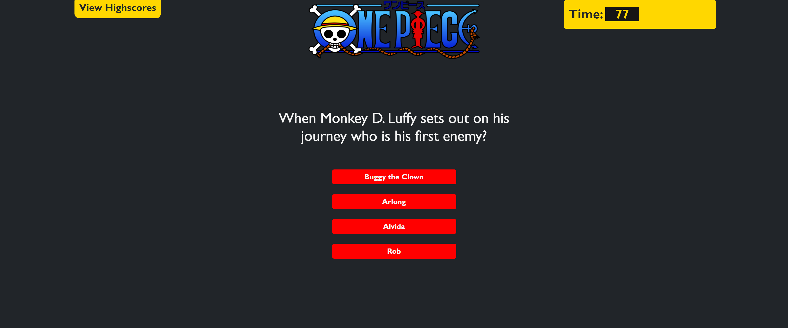

# onepiece-quiz 

https://github.com/dthompasionas/onepiece-quiz

# Description
Using Javascript I created a quiz that deducts 10 seconds for every wrong answer. High scores can be saved at the end.

# Table of Contents
* [License](#license) 
* [Installation](#installation)
* [Tests](#tests)
* [Usage](#usage)
* [Contribute](#contribute)
* [Questions](#questions)

# License 
This project is licensed with a Unlicensed license.

# Installation
The following necessary dependencies are required to run this app: N/A 

# Tests
The following command is needed to run test: N/A

# Usage
In order to use this app, This is a quiz on the Anime One Piece

# Contribute
Make a pull request and contact me below.

# Screenshot: 

# Questions
Contact me with any questions here:

*Github: dthompasionas

*email: dthompasionas@gmail.com 
